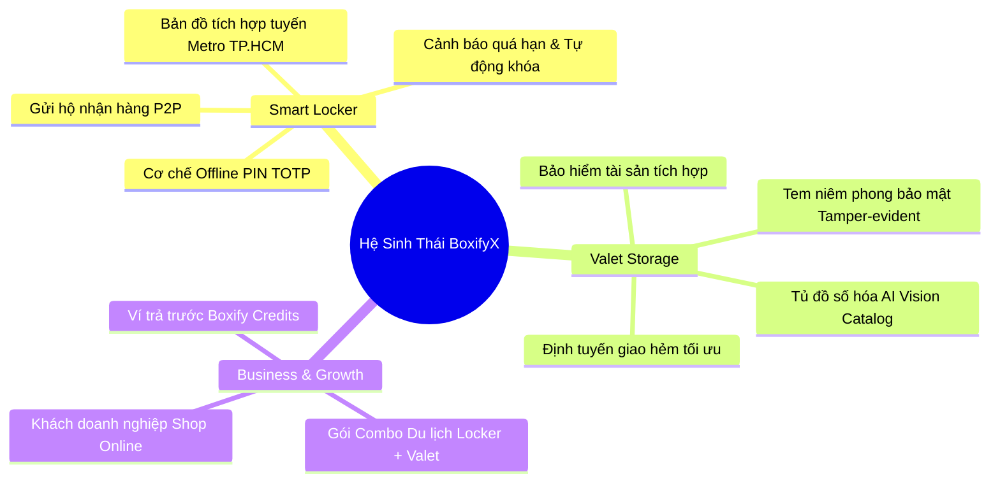

# 🧠 BRAINSTORM & STRATEGIC EXPLORATION: BOXIFYX

> **Dự án**: BoxifyX - Smart Locker & Valet Storage Platform (TP.HCM)  
> **Chuyên gia điều phối**: `@product-manager` & `@senior-architect`  
> **Mục tiêu**: Hoàn thiện hóa ý tưởng kinh doanh, tối ưu mô hình vận hành và giải quyết các bài toán ngách tại TP.HCM trước khi chốt PRD chính thức.

---

## 🧭 1. ĐÀO SÂU BÀI TOÁN & THỰC ĐỊA TP.HCM (TERRAIN & PROBLEM DISCOVERY)

### 1.1. Đặc thù đô thị & Hành vi người dùng TP.HCM
- **Hệ thống hẻm nhỏ & Giao thông**: Hơn 60% nhà ở TP.HCM nằm trong hẻm xe tải không vào được -> Đội giao nhận thùng Valet Storage cần tối ưu cho phương tiện xe máy (thùng Standard $60 \times 40 \times 40\text{ cm}$ thiết kế vừa vặn giá chở hàng xe máy).
- **Thời tiết nhiệt đới ẩm & Mùa mưa**: Đồ đạc (sách vở, quần áo da/dạ, đồ điện tử) rất dễ ẩm mốc nếu lưu kho thường -> Tiêu chuẩn kho bảo quản nhiệt độ $24-26^\circ\text{C}$, độ ẩm $< 60\%$ là điểm bán hàng độc nhất (USP).
- **Điểm nóng Smart Locker**:
  - *Hub Du lịch & Giải trí*: Phố đi bộ Nguyễn Huệ, Bùi Viện, Chợ Bến Thành, Landmark 81.
  - *Hub Giao thông*: Tuyến Metro số 1 (Bến Thành - Suối Tiên), Sân bay Tân Sơn Nhất, Bến xe Miền Đông mới, Ga Sài Gòn.
  - *Hub Công sở & Co-working*: Quận 1, Quận 3, Khu công nghệ cao TP.Thủ Đức.

---

## 💡 2. CÁC TÍNH NĂNG ĐỘT PHÁ CẦN BỔ SUNG VÀO Ý TƯỞNG CỐT LÕI

### 2.1. Phân hệ Smart Locker (Nâng cấp)
1. **Cơ chế Mở tủ Offline Fallback (TOTP PIN)**: Nếu trạm tủ bị mất sóng 4G/Internet tạm thời, người dùng vẫn có thể nhập mã PIN 6 số tạo theo thuật toán TOTP (Time-based One-Time Password) để mở tủ mà không sợ bị kẹt đồ.
2. **Kịch bản xử lý quá hạn (Overdue Handling)**:
   - Thông báo qua Zalo ZNS / SMS trước 30 phút và 15 phút.
   - Nếu quá hạn: Tủ tự động chuyển sang chế độ "Overdue Fee" (Tính cước phát sinh gấp 1.5 lần giờ thường sau 12h trễ) và yêu cầu thanh toán bù trước khi mở chốt.
3. **Tính năng Gửi hộ / Nhận đồ P2P (Peer-to-Peer Drop-off)**: Khách A gửi đồ vào tủ và chia sẻ mã PIN cho khách B đến lấy (rất hữu ích cho du khách check-in homestay sớm hoặc shop online giao hàng không tiếp xúc).

### 2.2. Phân hệ Valet Storage (Nâng cấp)
1. **Quy trình Niêm phong & Chống tráo đồ (Tamper-Evident Seal)**:
   - Mỗi thùng Standard có 2 chốt khóa nhựa có mã vạch / QR riêng biệt.
   - Shipper và Khách hàng cùng quét mã seal trước khi niêm phong và lúc giao trả, bảo đảm 100% tài sản không bị xâm phạm.
2. **Tủ đồ số hóa (Digital Virtual Closet) với AI Tự Động Phân Loại**:
   - Khi đồ về kho, nhân viên kho chụp ảnh tổng quan đồ bên trong.
   - AI (Gemini Vision) tự động gợi ý tên món đồ ("Áo len", "Giày thể thao", "Hồ sơ thuế 2024") để khách hàng có thể tìm kiếm nhanh trên Web App.
3. **Chính sách Lưu kho Linh hoạt (Partial Item Retrieval)**:
   - Khách có thể yêu cầu trả lẻ từng thùng thay vì bắt buộc phải lấy toàn bộ đơn hàng.

---

## ⚖️ 3. SO SÁNH 3 HƯỚNG TIẾP CẬN SẢN PHẨM (MULTI-OPTION MATRIX)

| Tiêu chí | Phương Án A: Lean MVP (Tối giản) | Phương Án B: Modern Smart Hub (Khuyến Nghị ⭐) | Phương Án C: Full Ecosystem (AI & IoT) |
| :--- | :--- | :--- | :--- |
| **Giao diện & Trải nghiệm** | Giao diện form đặt chỗ cơ bản, danh sách văn bản. | **UI/UX chuẩn 2026: Bento Grid, Dark/Light Mode, Bản đồ tương tác mượt mà, Virtual Closet trực quan.** | Tích hợp 3D Box Visualizer, AR đo kích thước đồ. |
| **Logic Smart Locker** | Đặt trước theo giờ, thanh toán cọc, nhận mã PIN online. | **Tính cước realtime, tự động giảm 20% khi $\ge 24\text{h}$, mở tủ 1-chạm, hỗ trợ PIN offline dự phòng.** | Mở tủ bằng FaceID tại trạm, cảm biến cân nặng đồ. |
| **Logic Valet Storage** | Form chọn số thùng, tính cước giao nhận theo Haversine. | **Tính cước Haversine chuẩn đô thị TP.HCM, Digital Wardrobe quản lý ảnh từng thùng, đặt lịch giao/trả linh hoạt.** | AI Vision tự động bóc tách và định giá từng món đồ, sàn ký gửi thanh lý đồ cũ trực tiếp từ kho. |
| **Thanh toán** | Chuyển khoản tay xác nhận thủ công. | **VietQR Dynamic Payload (tự động khớp lệnh thanh toán trong 2s).** | Tích hợp thẻ tín dụng quốc tế Stripe, Apple Pay, Ví trả trước. |
| **Thời gian triển khai** | 1 - 2 tuần | **2 - 3 tuần** | 6 - 8 tuần |
| **Mức độ khả thi & Phù hợp** | Đơn giản, khó cạnh tranh. | **Tối ưu nhất cho thị trường TP.HCM, trải nghiệm cao cấp, chi phí hợp lý.** | Chi phí phần cứng và R&D cao, phù hợp giai đoạn Series A. |

---

## 🎯 4. CÁC QUYẾT ĐỊNH THIẾT KẾ CẦN BẠN CHỌN LỰA

> [!IMPORTANT]
> Hãy xem xét các tùy chọn sau để chúng ta hoàn thiện mô hình kinh doanh BoxifyX:

1. **Phương thức Thanh toán Smart Locker**:
   - *Lựa chọn 1 (Pay-as-you-go / Trả sau)*: Khách quét cọc trước số tiền block 2h đầu, khi nào đến lấy đồ thì quét thanh toán nốt phần còn lại rồi cửa tự mở.
   - *Lựa chọn 2 (Prepaid / Trả trước toàn bộ theo giờ dự kiến)*: Khách chọn trước 5 giờ và trả đủ; nếu lấy trễ sẽ yêu cầu quét mã đóng tiền phạt quá giờ.
2. **Cơ chế Giao nhận Thùng rỗng Valet Storage**:
   - *Lựa chọn 1 (Giao thùng rỗng chờ khách đóng gói 15 phút rồi lấy ngay)*: Tiết kiệm chi phí shipper di chuyển 1 chuyến.
   - *Lựa chọn 2 (Giao thùng rỗng hôm nay, hẹn ngày mai quay lại lấy)*: Khách có thời gian thong thả phân loại và đóng gói đồ đạc.
3. **Chính sách Đặt cọc Thùng nhựa Standard**:
   - Thùng nhựa công nghiệp BoxifyX có độ bền cao ($60 \times 40 \times 40\text{ cm}$). Có cần thu tiền cọc thùng (VD: `100.000 đ`/thùng - hoàn trả khi kết thúc hợp đồng) để tránh khách làm mất thùng không?
