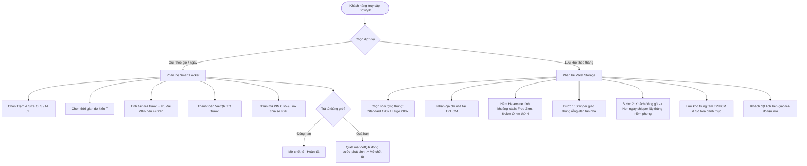
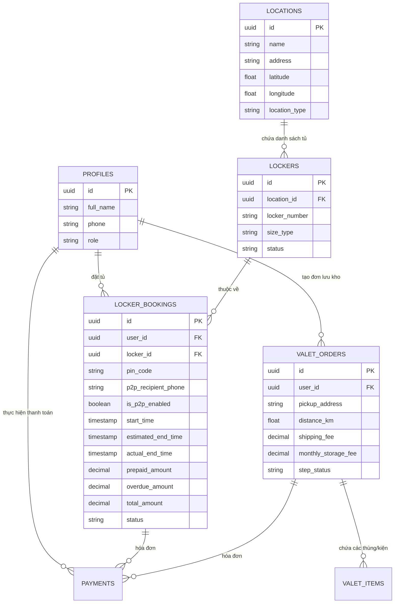

# 📦 TÀI LIỆU YÊU CẦU SẢN PHẨM (PRD)
# NỀN TẢNG LƯU TRỮ CÁ NHÂN & TỦ ĐỒ THÔNG MINH - BOXIFYX (TP.HCM)

> **Tên sản phẩm**: BoxifyX (Digital Valet Storage & Smart Locker Network)  
> **Thị trường mục tiêu**: Thành phố Hồ Chí Minh (TP.HCM)  
> **Nền tảng CSDL & Backend**: Supabase (PostgreSQL, Row Level Security, Realtime, Storage)  
> **Phiên bản**: v1.1.0 (Hoàn thiện nghiệp vụ)  
> **Ngày cập nhật**: 2026-08-29  

---

## 1. TỔNG QUAN SẢN PHẨM & TẦM NHÌN (PRODUCT VISION)

### 1.1. Tuyên bố sứ mệnh (Mission Statement)
BoxifyX giải phóng không gian sống và tối ưu hóa trải nghiệm di chuyển tại đô thị TP.HCM bằng việc cung cấp giải pháp lưu trữ đa tầng kết hợp:
1. **Mạng lưới Smart Locker**: Gửi hành lý/đồ đạc theo block giờ tự động tại các trạm giao thông, TTTM, phố đi bộ; hỗ trợ tính năng gửi hộ & nhận hàng P2P thông minh.
2. **Dịch vụ Valet Storage**: Giao nhận thùng lưu trữ tận nhà theo lịch hẹn 2 bước, bảo quản tại kho trung tâm nhiệt độ mát và quản lý danh mục đồ trực quan.

### 1.2. Mục tiêu kinh doanh & Vận hành (KPIs)
- **Tốc độ mở tủ**: Thời gian từ khi khách bấm xác nhận trên Web App đến khi chốt điện mở $< 1.5\text{ giây}$.
- **Tỷ lệ chính xác giao nhận**: $100\%$ thùng hàng có tem niêm phong bảo mật quét mã vạch trước và sau khi lưu kho.
- **Tiết kiệm chi phí bản đồ**: Tận dụng $100\%$ hàm tọa độ Haversine nội bộ trên Supabase thay vì chi phí API Google Maps.

---

## 2. QUY TẮC ĐỊNH GIÁ & NGHIỆP VỤ VẬN HÀNH (BUSINESS RULES)



### 2.1. Phân hệ Smart Locker (Tính theo Block giờ tại TP.HCM)

| Kích thước tủ | Loại hành lý phù hợp | Block 2 giờ đầu | Giờ tiếp theo (từ giờ thứ 3) | Ưu đãi đặc biệt |
| :--- | :--- | :--- | :--- | :--- |
| **Size S** | Balo, túi xách, laptop | **10.000 đ** | **5.000 đ** / giờ | Giảm **20%** tổng tiền nếu thuê $\ge 24\text{ giờ}$ |
| **Size M** | Vali cabin (Size 20"), túi xách lớn | **18.000 đ** | **8.000 đ** / giờ | Giảm **20%** tổng tiền nếu thuê $\ge 24\text{ giờ}$ |
| **Size L** | Vali lớn (Size 24-28"), đồ cồng kềnh | **25.000 đ** | **12.000 đ** / giờ | Giảm **20%** tổng tiền nếu thuê $\ge 24\text{ giờ}$ |

#### ⚙️ Cơ chế Thanh toán & Xử lý Quá hạn (Prepaid + Overdue Surcharge):
1. **Trả trước (Prepaid)**: Khách chọn thời gian dự kiến $T_{\text{est}}$ và thanh toán trước $100\%$ số tiền tạm tính qua VietQR.
2. **Quyết toán khi trả tủ (Check-out)**:
   - Nếu trả trước hoặc đúng giờ ($T_{\text{actual}} \le T_{\text{est}}$): Cửa tủ mở tức thì, kết thúc phiên thuê.
   - Nếu trả trễ ($T_{\text{actual}} > T_{\text{est}}$): Hệ thống tính số giờ trễ $\Delta T = \lceil T_{\text{actual}} - T_{\text{est}} \rceil$. Màn hình hiển thị mã VietQR thanh toán cước phát sinh:
     $$\text{Overdue Fee} = \Delta T \times \text{Price}_{\text{extra\_hour}}$$
     Sau khi cổng thanh toán xác nhận giao dịch thành công (qua Webhook), cửa tủ tự động mở.

#### 🤝 Nghiệp vụ Gửi hộ & Nhận hàng P2P (Peer-to-Peer Drop-off):
- Khách gửi A có thể kích hoạt tùy chọn: **"Ủy quyền cho người khác lấy đồ"**.
- Hệ thống tạo một liên kết bảo mật (Secure Pass Link) và mã PIN 6 số riêng gửi qua SMS/Zalo cho Người nhận B.
- Người nhận B chỉ cần đến đúng trạm tủ, quét mã QR trên màn hình hoặc nhập PIN để mở tủ mà không cần tải app hay đăng nhập tài khoản của A.

---

### 2.2. Phân hệ Valet Storage (Lưu trữ theo thùng chuẩn theo tháng)

| Quy cách lưu trữ | Kích thước / Chi tiết | Giá cước / tháng | Tiêu chuẩn bảo quản |
| :--- | :--- | :--- | :--- |
| **Thùng Standard** | $60 \times 40 \times 40\text{ cm}$ (Nhựa Polypropylene nguyên sinh) | **120.000 đ** / thùng / tháng | Niêm phong chốt bảo mật có mã vạch riêng, chống ẩm |
| **Thùng Large / Đồ quá khổ** | Vali size lớn, đệm gấp, nhạc cụ, xe đạp, cây cảnh mini | **200.000 đ** / kiện / tháng | Bọc màng PE chống xước, lưu trữ kệ pallet chuyên dụng |

#### 🚚 Quy trình Giao nhận 2 Bước (Two-Step Scheduled Logistics):
- **Bước 1 (Giao thùng rỗng)**: Shipper vận chuyển thùng nhựa rỗng và bộ seal niêm phong tới địa chỉ khách hàng.
- **Bước 2 (Khách đóng gói & Hẹn giờ lấy)**: Khách hàng thong thả phân loại đồ đạc, dán nhãn, bấm chốt niêm phong và chọn khung giờ hẹn shipper quay lại lấy trên Web App.

#### 🧭 Công thức Cước Vận Chuyển Haversine tại TP.HCM:
- **Tọa độ Kho Trung Tâm BoxifyX TP.HCM**: `10.8231, 106.6297` (Khu Logistics Tân Bình / Quận 12).
- **Chính sách**:
  - Khoảng cách $\le 3\text{ km}$ đầu: **MIỄN PHÍ ($0\text{ đ}$)**.
  - Từ km thứ 4 trở đi: **$6.000\text{ đ} / \text{km}$**.
  - Áp dụng hệ số uốn khúc giao thông đô thị $1.25$.
$$\text{Distance}_{\text{urban}} = \text{Haversine}(lat_{\text{kho}}, lon_{\text{kho}}, lat_{\text{khách}}, lon_{\text{khách}}) \times 1.25$$
$$\text{Shipping Fee} = \begin{cases} 0 & \text{khi } \text{Distance}_{\text{urban}} \le 3 \\ \lceil \text{Distance}_{\text{urban}} - 3 \rceil \times 6.000\text{ đ} & \text{khi } \text{Distance}_{\text{urban}} > 3 \end{cases}$$

---

## 3. KIẾN TRÚC HỆ THỐNG & CƠ SỞ DỮ LIỆU SUPABASE



### 3.1. DDL Schema Supabase (PostgreSQL)

```sql
-- Kích hoạt extension UUID
CREATE EXTENSION IF NOT EXISTS "uuid-ossp";

-- 1. BẢNG HỒ SƠ NGƯỜI DÙNG (Liên kết với Supabase Auth)
CREATE TABLE public.profiles (
    id UUID PRIMARY KEY REFERENCES auth.users(id) ON DELETE CASCADE,
    full_name TEXT NOT NULL,
    phone TEXT UNIQUE NOT NULL,
    avatar_url TEXT,
    role TEXT DEFAULT 'customer' CHECK (role IN ('customer', 'driver', 'warehouse_staff', 'admin')),
    created_at TIMESTAMPTZ DEFAULT NOW()
);

-- 2. BẢNG ĐỊA ĐIỂM TRẠM TỦ & KHO TỔNG TP.HCM
CREATE TABLE public.locations (
    id UUID PRIMARY KEY DEFAULT uuid_generate_v4(),
    name TEXT NOT NULL,
    address TEXT NOT NULL,
    district TEXT NOT NULL,
    latitude DOUBLE PRECISION NOT NULL,
    longitude DOUBLE PRECISION NOT NULL,
    location_type TEXT NOT NULL CHECK (location_type IN ('smart_locker_hub', 'central_warehouse')),
    operating_hours TEXT DEFAULT '24/7',
    is_active BOOLEAN DEFAULT TRUE,
    created_at TIMESTAMPTZ DEFAULT NOW()
);

-- 3. BẢNG CÁC NGĂN TỦ (LOCKERS)
CREATE TABLE public.lockers (
    id UUID PRIMARY KEY DEFAULT uuid_generate_v4(),
    location_id UUID NOT NULL REFERENCES public.locations(id) ON DELETE CASCADE,
    locker_number TEXT NOT NULL,
    size_type TEXT NOT NULL CHECK (size_type IN ('S', 'M', 'L')),
    status TEXT DEFAULT 'available' CHECK (status IN ('available', 'reserved', 'occupied', 'maintenance')),
    is_door_closed BOOLEAN DEFAULT TRUE,
    created_at TIMESTAMPTZ DEFAULT NOW()
);

-- 4. BẢNG ĐƠN ĐẶT TỦ (CÓ HỖ TRỢ P2P VÀ QUẢN LÝ CƯỚC TRẢ TRƯỚC/QUÁ HẠN)
CREATE TABLE public.locker_bookings (
    id UUID PRIMARY KEY DEFAULT uuid_generate_v4(),
    user_id UUID NOT NULL REFERENCES public.profiles(id),
    locker_id UUID NOT NULL REFERENCES public.lockers(id),
    start_time TIMESTAMPTZ NOT NULL DEFAULT NOW(),
    estimated_end_time TIMESTAMPTZ NOT NULL,
    actual_end_time TIMESTAMPTZ,
    pin_code VARCHAR(6) NOT NULL,
    size_type TEXT NOT NULL,
    -- Hỗ trợ chia sẻ P2P
    is_p2p_enabled BOOLEAN DEFAULT FALSE,
    p2p_recipient_phone TEXT,
    p2p_recipient_name TEXT,
    p2p_pass_token TEXT UNIQUE,
    -- Tài chính & Cước phí
    prepaid_amount NUMERIC(12, 2) NOT NULL DEFAULT 0,
    overdue_amount NUMERIC(12, 2) NOT NULL DEFAULT 0,
    discount_amount NUMERIC(12, 2) NOT NULL DEFAULT 0,
    total_amount NUMERIC(12, 2) NOT NULL DEFAULT 0,
    status TEXT DEFAULT 'active' CHECK (status IN ('pending_payment', 'active', 'overdue_pending_payment', 'completed', 'cancelled')),
    created_at TIMESTAMPTZ DEFAULT NOW()
);

-- 5. BẢNG ĐƠN LƯU KHO VALET (QUY TRÌNH 2 BƯỚC)
CREATE TABLE public.valet_orders (
    id UUID PRIMARY KEY DEFAULT uuid_generate_v4(),
    user_id UUID NOT NULL REFERENCES public.profiles(id),
    warehouse_id UUID NOT NULL REFERENCES public.locations(id),
    pickup_address TEXT NOT NULL,
    pickup_latitude DOUBLE PRECISION NOT NULL,
    pickup_longitude DOUBLE PRECISION NOT NULL,
    distance_km NUMERIC(6, 2) NOT NULL,
    shipping_fee NUMERIC(12, 2) NOT NULL DEFAULT 0,
    monthly_storage_fee NUMERIC(12, 2) NOT NULL DEFAULT 0,
    step_status TEXT DEFAULT 'empty_box_scheduled' CHECK (step_status IN (
        'empty_box_scheduled',   -- Đã hẹn giao thùng rỗng
        'empty_box_delivered',   -- Đã giao thùng rỗng đến nhà
        'packed_pickup_scheduled',-- Đã hẹn ngày shipper đến lấy thùng đầy
        'in_warehouse',          -- Đã nhập kho trung tâm an toàn
        'return_requested',      -- Khách yêu cầu giao trả đồ
        'completed'              -- Đã giao trả và hoàn tất
    )),
    empty_box_delivery_date TIMESTAMPTZ,
    packed_pickup_date TIMESTAMPTZ,
    start_date DATE NOT NULL DEFAULT CURRENT_DATE,
    created_at TIMESTAMPTZ DEFAULT NOW()
);

-- 6. BẢNG CHI TIẾT THÙNG/KIỆN ĐỒ
CREATE TABLE public.valet_items (
    id UUID PRIMARY KEY DEFAULT uuid_generate_v4(),
    order_id UUID NOT NULL REFERENCES public.valet_orders(id) ON DELETE CASCADE,
    box_code TEXT UNIQUE NOT NULL,
    security_seal_number TEXT, -- Mã số chốt niêm phong
    item_type TEXT NOT NULL CHECK (item_type IN ('standard_box_60x40x40', 'large_oversized')),
    title TEXT NOT NULL,
    description TEXT,
    warehouse_bin TEXT,
    status TEXT DEFAULT 'in_storage' CHECK (status IN ('with_customer', 'in_transit', 'in_storage', 'returned')),
    created_at TIMESTAMPTZ DEFAULT NOW()
);

-- 7. BẢNG THANH TOÁN (PAYMENTS - VIETQR WEBHOOK)
CREATE TABLE public.payments (
    id UUID PRIMARY KEY DEFAULT uuid_generate_v4(),
    user_id UUID NOT NULL REFERENCES public.profiles(id),
    locker_booking_id UUID REFERENCES public.locker_bookings(id),
    valet_order_id UUID REFERENCES public.valet_orders(id),
    payment_type TEXT NOT NULL CHECK (payment_type IN ('prepaid_locker', 'overdue_locker', 'valet_monthly', 'shipping_fee')),
    amount NUMERIC(12, 2) NOT NULL,
    payment_method TEXT NOT NULL CHECK (payment_method IN ('vietqr', 'momo', 'vnpay', 'wallet')),
    status TEXT DEFAULT 'pending' CHECK (status IN ('pending', 'successful', 'failed')),
    transaction_ref TEXT UNIQUE,
    paid_at TIMESTAMPTZ,
    created_at TIMESTAMPTZ DEFAULT NOW()
);

-- ----------------------------------------------------
-- 8. HÀM TÍNH KHOẢNG CÁCH HAVERSINE & CƯỚC SHIP TP.HCM
-- ----------------------------------------------------
CREATE OR REPLACE FUNCTION calculate_haversine_distance(
    lat1 DOUBLE PRECISION,
    lon1 DOUBLE PRECISION,
    lat2 DOUBLE PRECISION,
    lon2 DOUBLE PRECISION
)
RETURNS NUMERIC AS $$
DECLARE
    r NUMERIC := 6371.0;
    dlat NUMERIC;
    dlon NUMERIC;
    a NUMERIC;
    c NUMERIC;
    urban_distance NUMERIC;
BEGIN
    dlat := radians(lat2 - lat1);
    dlon := radians(lon2 - lon1);
    a := sin(dlat / 2)^2 + cos(radians(lat1)) * cos(radians(lat2)) * sin(dlon / 2)^2;
    c := 2 * atan2(sqrt(a), sqrt(1 - a));
    urban_distance := (r * c) * 1.25; -- Hệ số đường phố TP.HCM
    RETURN round(urban_distance::numeric, 2);
END;
$$ LANGUAGE plpgsql IMMUTABLE;

CREATE OR REPLACE FUNCTION calculate_valet_shipping_fee(dist_km NUMERIC)
RETURNS NUMERIC AS $$
BEGIN
    IF dist_km <= 3.0 THEN
        RETURN 0;
    ELSE
        RETURN ceil(dist_km - 3.0) * 6000;
    END IF;
END;
$$ LANGUAGE plpgsql IMMUTABLE;

-- ----------------------------------------------------
-- 9. HÀM TÍNH TIỀN SMART LOCKER (GIẢM 20% KHI >= 24H)
-- ----------------------------------------------------
CREATE OR REPLACE FUNCTION calculate_locker_fee(p_size TEXT, p_hours NUMERIC)
RETURNS JSONB AS $$
DECLARE
    v_hours INT := ceil(p_hours);
    v_first_2h NUMERIC;
    v_extra_h NUMERIC;
    v_subtotal NUMERIC := 0;
    v_discount NUMERIC := 0;
    v_final NUMERIC := 0;
BEGIN
    IF v_hours < 1 THEN v_hours := 1; END IF;
    CASE p_size
        WHEN 'S' THEN v_first_2h := 10000; v_extra_h := 5000;
        WHEN 'M' THEN v_first_2h := 18000; v_extra_h := 8000;
        WHEN 'L' THEN v_first_2h := 25000; v_extra_h := 12000;
        ELSE RAISE EXCEPTION 'Invalid locker size';
    END CASE;

    IF v_hours <= 2 THEN
        v_subtotal := v_first_2h;
    ELSE
        v_subtotal := v_first_2h + ((v_hours - 2) * v_extra_h);
    END IF;

    IF v_hours >= 24 THEN
        v_discount := round(v_subtotal * 0.20);
    END IF;

    v_final := v_subtotal - v_discount;
    RETURN jsonb_build_object(
        'size', p_size,
        'hours', v_hours,
        'subtotal', v_subtotal,
        'discount', v_discount,
        'total', v_final
    );
END;
$$ LANGUAGE plpgsql IMMUTABLE;
```

---

## 4. MA TRẬN TÍNH NĂNG GIAO DIỆN WEB & PWA (UI/UX SPECIFICATION)

### 4.1. Trang chủ & Bản đồ tìm trạm (Smart Discovery)
- **Map View (Leaflet + OpenStreetMap)**:
  - Hiển thị các pin trạm tủ tại các điểm nóng TP.HCM (Sân bay Tân Sơn Nhất, Phố Bùi Viện, Nhà thờ Đức Bà, Ga Sài Gòn, Landmark 81, Thảo Điền).
  - Tự động hiển thị số lượng ô tủ trống theo từng Size (S, M, L) với màu sắc trực quan (Xanh: Còn nhiều, Vàng: Sắp hết, Đỏ: Đã đầy).
  - Nút **"Tìm trạm gần tôi nhất"** sử dụng định vị GPS trình duyệt.

### 4.2. Giao diện Đặt Smart Locker & Thanh Toán
- **Bộ chọn thời gian trực quan (Interactive Duration Slider)**: Kéo chọn từ 1h đến 72h, hệ thống tự động hiển thị badge **"Giảm 20% khi thuê từ 24h"**.
- **Tùy chọn Ủy quyền P2P**: Nhập SĐT & Tên người nhận -> Tạo mã Pass mở tủ riêng.
- **Mã VietQR động**: Hiển thị QR thanh toán kèm số tiền chính xác, hệ thống tự động chuyển trạng thái sang "Đã xác nhận" khi nhận được Webhook.

### 4.3. Giao diện Đặt Valet Storage (Lưu Kho Theo Tháng)
- **Bộ tính giá cước tương tác (Live Estimator)**:
  - Bộ đếm số lượng thùng Standard ($60 \times 40 \times 40\text{ cm}$) và Kiện quá khổ Large.
  - Ô nhập địa chỉ nhà tại TP.HCM -> Tính cước vận chuyển tức thì (Hiển thị rõ "Miễn phí 3km đầu").
  - Chọn lịch hẹn 2 bước: Ngày nhận thùng rỗng và Ngày hẹn shipper đến lấy hàng.

---

## 5. KẾ HOẠCH BÀN GIAO & PHÁT TRIỂN (NEXT STEPS)
1. **Frontend Implementation**: Khởi tạo project Web App với Next.js / Tailwind CSS, thiết kế giao diện chuẩn phong cách hiện đại (Dark/Light theme, Bento card).
2. **Interactive Mock Engine**: Tích hợp các bộ tính cước Haversine và tính tiền Locker theo thời gian thực để người dùng trải nghiệm trước.
3. **Supabase Integration**: Kết nối cơ sở dữ liệu và kích hoạt cơ chế Realtime.
