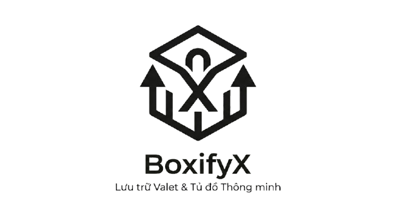
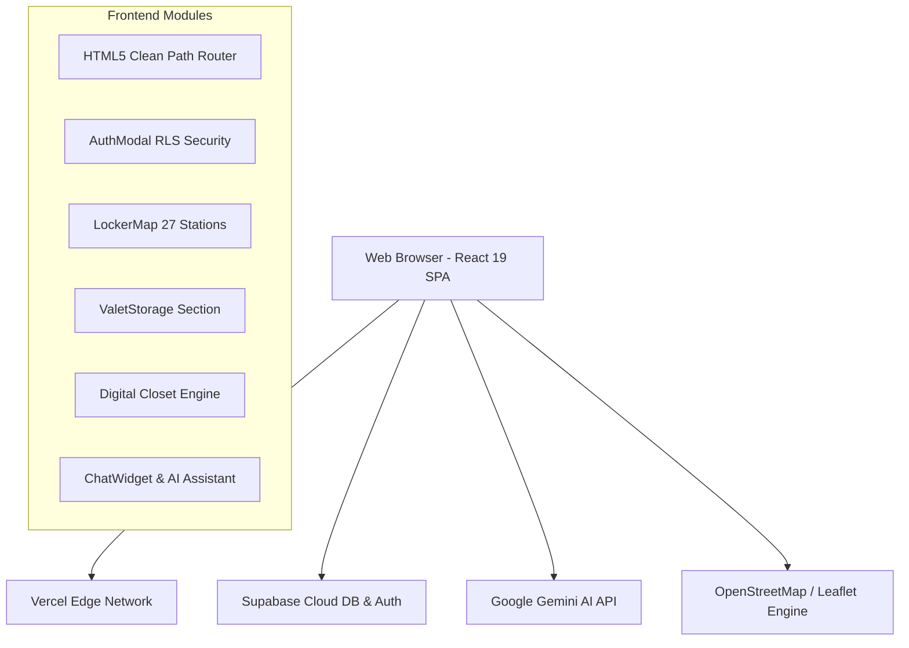

<p align="center">
  
</p>

<h1 align="center">📦 BoxifyX - Nền Tảng Lưu Trữ Valet & Smart Locker TP.HCM</h1>

<p align="center">
  <b>Hệ thống lưu trữ thông minh tích hợp Smart Locker IOT theo giờ tại 27 trạm và Lưu Kho Valet Storage 25°C giao nhận tận nhà theo tháng tại TP. Hồ Chí Minh.</b>
</p>

<p align="center">
  <a href="https://boxifyx.vercel.app/" target="_blank">
    
  </a>
  
  
  
  
  
</p>

---

## 🌟 Tính Năng Nổi Bật (Key Features)

### 1. ⚡ Mạng Lưới Smart Locker IOT (Theo Giờ)
- **27 Trạm Kiosk Phủ Khắp TP.HCM**: Sân bay Tân Sơn Nhất (Ga Quốc Tế & Quốc Nội), Ga Sài Gòn, 6 Ga Metro Tuyến 1 Bến Thành - Suối Tiên, Phố Tây Bùi Viện, Landmark 81, Bitexco, Crescent Mall, Vạn Hạnh Mall, Gigamall, Làng Đại Học ĐHQG...
- **Bản Đồ GPS Vệ Tinh Trực Quan**: Tìm trạm gần nhất, xem số ô tủ trống thời gian thực, lọc theo quận và kích cỡ tủ.
- **Biểu Phí Chuẩn & Minh Bạch**:
  - **Size S** (30x40x50cm - Balo, túi xách): `15.000đ / 2h đầu` (+5.000đ/h tiếp theo).
  - **Size M** (45x50x60cm - Vali cabin 20"): `25.000đ / 2h đầu` (+8.000đ/h tiếp theo).
  - **Size L** (60x60x85cm - Vali lớn 28"): `40.000đ / 2h đầu` (+12.000đ/h tiếp theo).
  - 🎁 *Chiết khấu 20% khi thuê từ 6 tiếng trở lên.*
- **Mở Tủ Kiosk 1-Chạm**: Nhận **Mã PIN 6 số** và **Mã QR** ngay sau khi đặt để mở tủ tức thì.

### 2. 🚚 Dịch Vụ Lưu Kho Valet Storage (Theo Tháng)
- **Kho Máy Lạnh Tân Bình 25°C & Độ Ẩm <50%**: Chống ẩm mốc tuyệt đối cho quần áo, đồ da, tài liệu, thiết bị điện tử.
- **Biểu Phí Lưu Trữ**:
  - **Thùng Standard (60x40x40cm)**: `120.000đ / tháng / thùng`.
  - **Kiện Quá Khổ / Pallet**: `200.000đ / tháng / kiện`.
- **Shipper Giao Nhận Tận Cửa**: Miễn phí 3km đầu tiên, chỉ 5.000đ/km tiếp theo.
- **Bảo Vệ Đa Tầng**: Chốt Seal niêm phong mã số độc quyền + Bảo hiểm tài sản mặc định `20.000.000 VNĐ / kiện`.

### 3. 👗 Tủ Đồ Kỹ Thuật Số (Digital Closet)
- Quản lý ảo toàn bộ đồ đạc gửi trong kho: Xem ảnh chụp HD, mã Seal, nhiệt độ và độ ẩm thực tế.
- Bấm 1-chạm **"Yêu Cầu Giao Trả"** để shipper mang đồ về tận nhà trong vòng **2 – 4 giờ**.

### 4. 🤖 Trợ Lý AI Trực Tuyến 24/7 (Google Gemini AI)
- Tích hợp **Google Gemini 3.5 Flash / Flash Lite** với System Prompt tiếng Việt 100%, am hiểu sâu sắc về hệ thống trạm tủ, báo giá và xử lý sự cố.
- Khay mạng xã hội (Hotline, Zalo OA, Messenger, Telegram, TikTok) dạng popup thu/mở thông minh.
- Nút **ScrollToTop** độc lập đặt ngay phía trên nút Chat AI.

### 5. 🗄️ Lưu Trữ Kép Bền Vững (Dual Persistence)
- Tự động đồng bộ hai chiều giữa **Supabase Cloud PostgreSQL** và **LocalStorage Cache**.
- Dữ liệu đơn hàng và tủ đồ **không bao giờ bị mất** khi tải lại trang, đổi thiết bị hoặc đăng xuất/đăng nhập lại.

---

## 🏗️ Kiến Trúc Hệ Thống (Architecture)



---

## 💻 Công Nghệ Sử Dụng (Tech Stack)

- **Frontend Core**: React 19, TypeScript, Vite 6.
- **Styling**: Tailwind CSS, PostCSS, Lucide React Icons.
- **Map & Geolocation**: Leaflet, React-Leaflet, OpenStreetMap API.
- **Backend & Cloud DB**: Supabase (PostgreSQL, Row Level Security, Auth).
- **Artificial Intelligence**: Google Gemini API (v1beta `gemini-3.5-flash`, `gemini-flash-lite-latest`).
- **Deployment**: Vercel Edge Network với cấu hình `vercel.json` SPA Rewrites.

---

## 🚀 Hướng Dẫn Cài Đặt & Chạy Cục Bộ (Getting Started)

### 1. Clone repository
```bash
git clone https://github.com/minhhuyzzz/BoxifyX.git
cd BoxifyX
```

### 2. Cài đặt dependencies
```bash
npm install
```

### 3. Cấu hình biến môi trường (`.env`)
Tạo file `.env` tại thư mục gốc của dự án với nội dung:
```env
VITE_SUPABASE_URL=https://mwoukwlfbbelsubebnrt.supabase.co
VITE_SUPABASE_ANON_KEY=eyJhbGciOiJIUzI1NiIsInR5cCI6IkpXVCJ9...

# Google Gemini API Key (Lấy miễn phí tại https://aistudio.google.com/app/apikey)
VITE_GEMINI_API_KEY=your_gemini_api_key_here
```

### 4. Chạy môi trường phát triển (Development Server)
```bash
npm run dev
```
Truy cập ứng dụng tại: `http://localhost:5173/`

### 5. Đóng gói cho môi trường Production (Build)
```bash
npm run build
```

---

## 📁 Cấu Trúc Thư Mục Dự Án (Project Structure)

```text
BoxifyX/
├── public/                  # Logo, favicon, hình ảnh tĩnh
├── src/
│   ├── components/          # Các components giao diện (Navbar, Footer, LockerMap, ChatWidget...)
│   ├── pages/               # Các trang chính (HomePage, LockerPage, ValetPage, FaqPage...)
│   ├── services/            # Kết nối API (supabaseService.ts, aiService.ts)
│   ├── lib/                 # Config client (supabaseClient.ts, pricing.ts)
│   ├── types/               # TypeScript Interfaces & Types
│   ├── data/                # Mock data & 27 trạm Smart Locker TP.HCM
│   ├── App.tsx              # Component gốc & HTML5 Path Router
│   ├── main.tsx             # Entry point
│   └── index.css            # Custom CSS & Tailwind styles
├── index.html               # HTML5 Template & SEO Meta Tags
├── vercel.json              # Cấu hình SPA Rewrites trên Vercel
├── package.json             # Dependencies & Scripts
├── tsconfig.json            # Cấu hình TypeScript
└── vite.config.ts           # Cấu hình Vite
```

---

## 🌐 Triển Khai Lên Vercel (Vercel Deployment)

1. Đẩy mã nguồn lên GitHub:
   ```bash
   git push origin main
   ```
2. Import project vào **[Vercel](https://vercel.com/)**.
3. Cài đặt các **Environment Variables** trên Vercel Dashboard:
   - `VITE_SUPABASE_URL`
   - `VITE_SUPABASE_ANON_KEY`
   - `VITE_GEMINI_API_KEY`
4. Bấm **Deploy** -> Website sẽ tự động xuất bản tại **`https://boxifyx.vercel.app/`**.

---

## 📞 Liên Hệ & Hỗ Trợ (Contact & Support)

- 🌐 **Website**: [https://boxifyx.vercel.app/](https://boxifyx.vercel.app/)
- 📞 **Hotline 24/7**: `0777 868 762`
- 💬 **Zalo Official Account**: [0777 868 762](https://zalo.me/0777868762)
- ✉️ **Email**: `hotro@boxifyx.vn`
- 📍 **Kho Tổng Trung Tâm**: `102 Hoàng Văn Thụ, Phường 2, Tân Bình, TP. Hồ Chí Minh`

---

<p align="center">
  <b>Made with ❤️ by BoxifyX Engineering Team</b>
</p>
